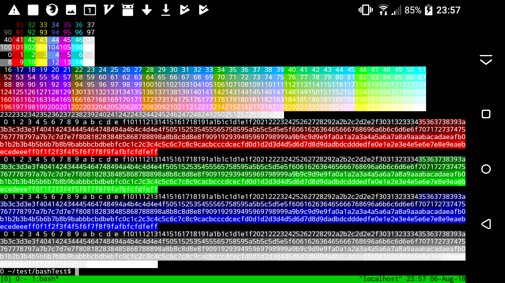
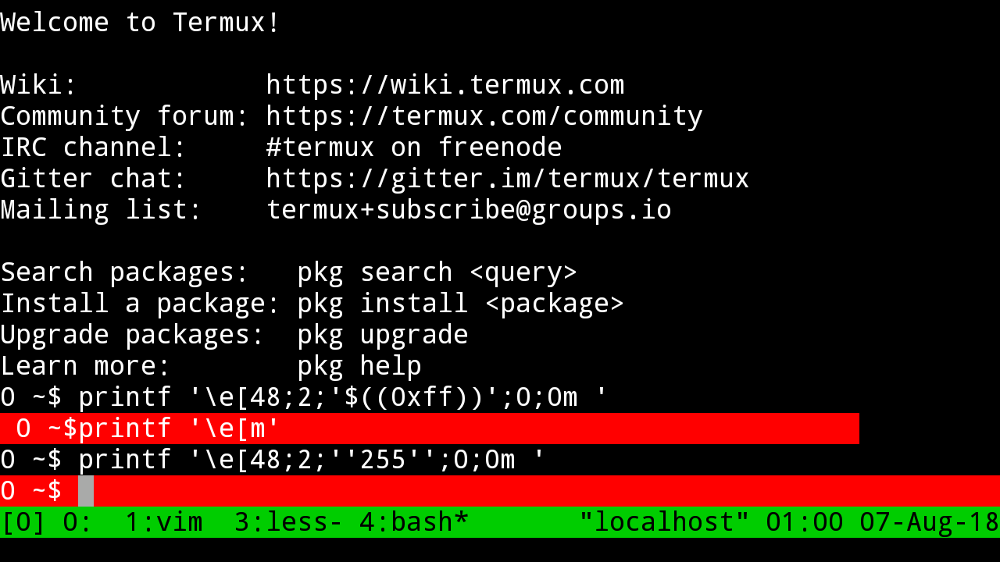
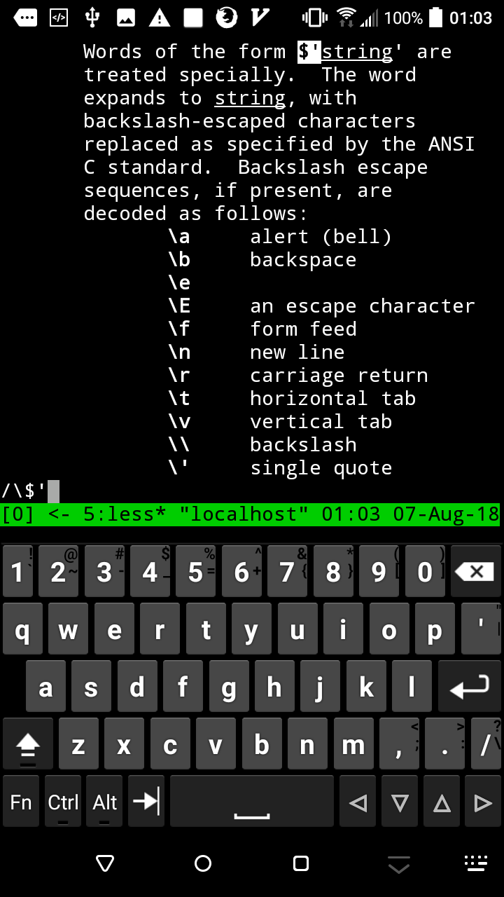

# bash-SGR-color-demo
Demonstrate how to use bash script to print SGR to change terminal display colors  
Usage: ./color.bash  

The script is written for Termux on Android, change shebang in the script to run on other systems.  
[SGR](https://en.wikipedia.org/wiki/ANSI_escape_code#SGR_(Select_Graphic_Rendition)_parameters) is ANSI escape sequences to change terminal display colors, visit
[ANSI escape code - Wikipedia](https://en.wikipedia.org/wiki/ANSI_escape_code#Colors) for more info about it.  
Running result of the script on Termux:  
Entering hex code in bash to change terminal color is also possible, e.g.  
```printf '\e[48;2;'$((0xff))';0;0m'' '```  
and  
```printf '\e[48;2;''255'';0;0m'' '```  
are the same.  

Type /\\$' in ```man bash``` for more info.

